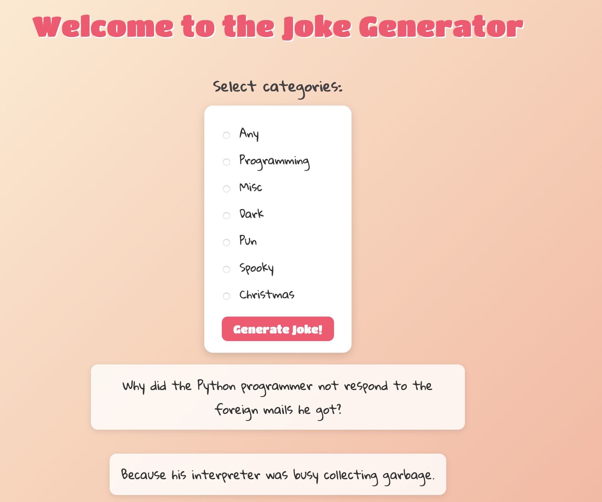

# 🎭 Joke Generator

A fun and interactive Joke Generator web app built with **Node.js**, **Express**, **EJS**, and **Axios**.  
Users can select from multiple categories and instantly fetch random two-part jokes using the [JokeAPI](https://jokeapi.dev/).

---

## 🚀 Features
- Select from categories: Any, Programming, Misc, Dark, Pun, Spooky, Christmas.
- Fetches jokes dynamically from JokeAPI.
- Clean and playful UI styled with CSS and Google Fonts.
- Server-side rendering with EJS templates.

---

## 📸 Preview
  

---

## 🛠️ Tech Stack
- **Backend:** Node.js, Express  
- **Frontend:** EJS, CSS, Google Fonts  
- **API:** [JokeAPI](https://jokeapi.dev/)  

---

## 📂 Project Setup

1. Clone the repo:
   ```bash
   git clone https://github.com/your-username/joke-generator.git
   cd joke-generator
2. Install dependencies:

   bash
   Copy code
   npm install
  
3. Run the app:
  
  bash
  Copy code

  npm start
  The app will run at http://localhost:3000
  
  🎉 How It Works
  Choose a joke category.
  
  Click Generate Joke!
  
  A setup and punchline will appear below.
  
  🤝 Contributing
  Feel free to fork this repo and submit a pull request with improvements!
  
  📜 License
  This project is licensed under the MIT License.
